# Mitigating Regression-to-the-Mean Effects in Pose-Based Autoregressive Sign Language Production

## Abstract
Sign Language Production (SLP) aims to generate sign language representations from spoken-language inputs. Existing autoregressive SLP models often suffer from regression-to-the-mean (RTM) effects, where continuous keypoint prediction produces over-smoothed motions and reduces sign expressiveness. Moreover, accumulated prediction errors during sequential generation can degrade long-term motion consistency. This paper proposes an autoregressive Transformer framework for text-to-sign and gloss-to-sign generation. To improve the quality of generated sign motions, the framework introduces three main components. First, we propose an RTM loss function designed to preserve temporal variations in sign keypoint sequences and mitigate motion over-smoothing. Second, a recursive keypoint reasoning module is introduced to refine generated motion representations and enhance keypoint accuracy. Third, a large language model-based linguistic prosody prediction module is integrated to estimate gloss-level intensity information for conditional sign generation. The proposed method is evaluated on PHOENIX14T, How2Sign, and mDGS using back-translation metrics and pose-quality metrics, including Dynamic Time Warping Mean Joint Error, Fréchet Gesture Distance, and Mean Absolute Error of Joint Coordinates. Experimental results demonstrate that the proposed framework consistently improves motion quality while maintaining competitive translation performance. On PHOENIX14T, the proposed model reduces Fréchet Gesture Distance from 43.477–54.505 to 0.500 for text-to-sign generation and improves gloss-to-sign BLEU-4 performance from 6.03 to 6.27, confirming its effectiveness for temporally consistent sign language generation. Similar pose-quality improvements are observed on How2Sign and mDGS, demonstrating the generalization ability of the proposed framework, although back-translation performance gains remain dataset-dependent.

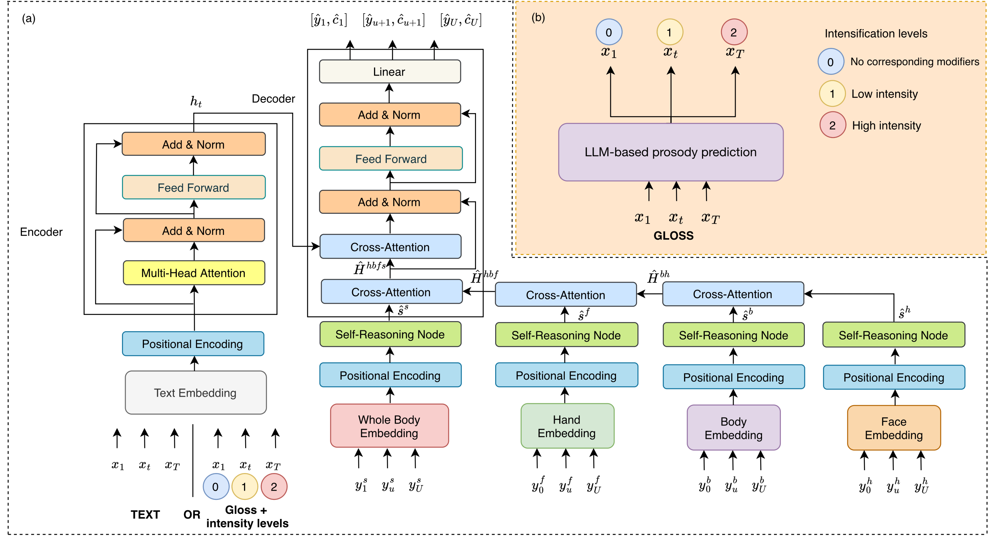

## Demo
We provide qualitative demonstrations of the generated sign pose sequences produced by the proposed framework. Each visualization contains two synchronized skeleton sequences for direct comparison between the generated output and the reference motion.

- **Left skeleton:** Ground-truth pose sequence extracted from the original sign language video.
- **Right skeleton:** Generated pose sequence predicted by our proposed method.

The demonstrations are organized into two sign language production configuration:

- **Text-to-Sign (T2S):** generating sign pose sequences directly from spoken language inputs.
- **Gloss-to-Sign (G2S):** generating sign pose sequences from gloss-level sign representations with intensity information.

### Text-to-Sign (T2S) Examples

### RWTH-PHOENIX-Weather-2014T

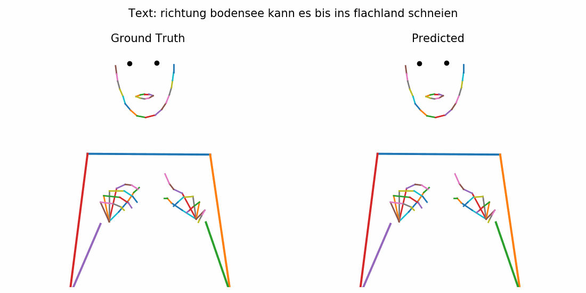

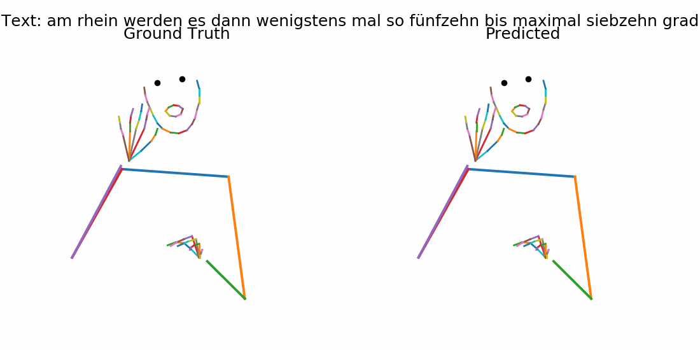

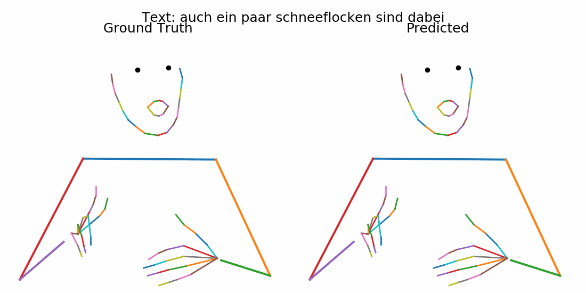

### Meine DGS Annotated

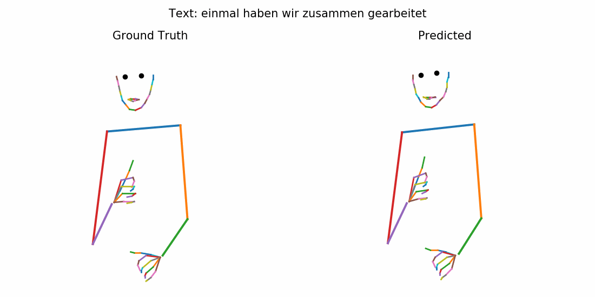

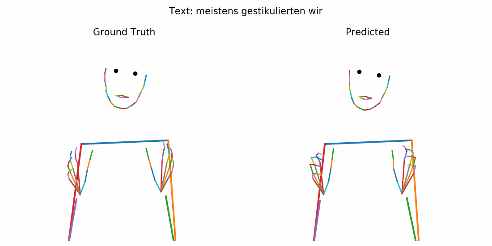

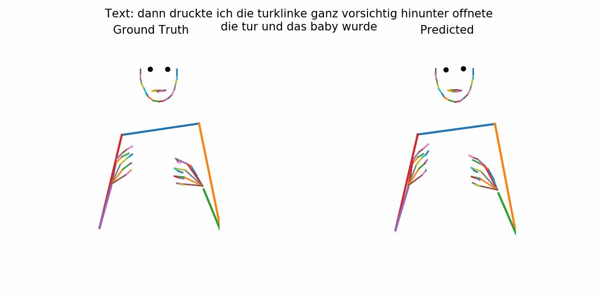

### How2Sign

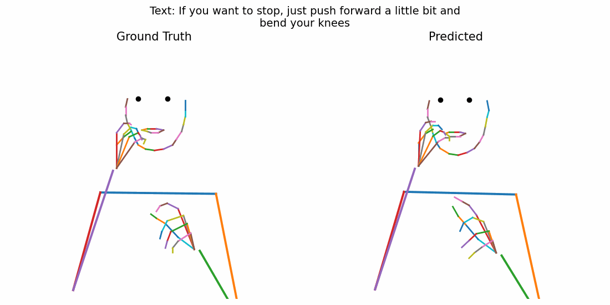

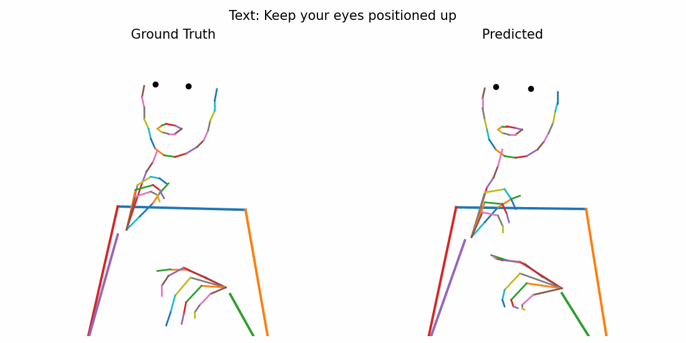

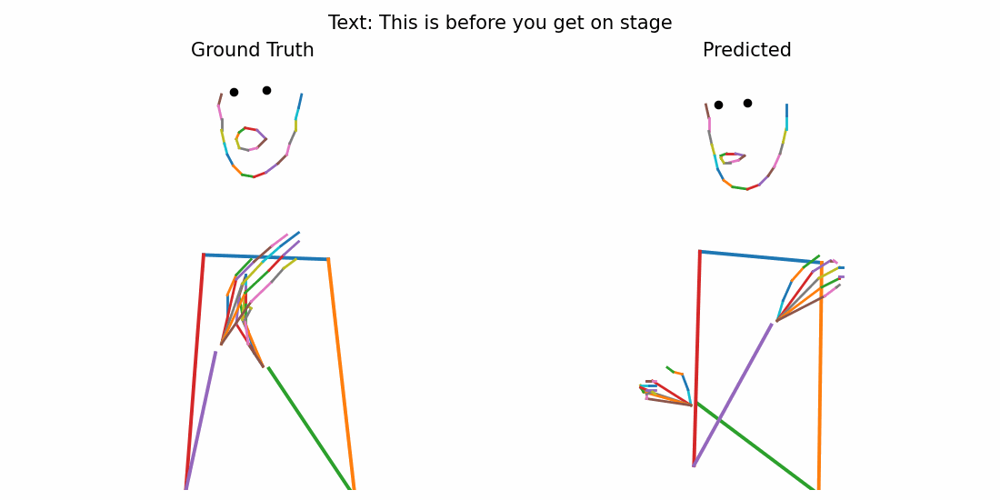

### Gloss-to-Sign (G2S) Examples

### RWTH-PHOENIX-Weather-2014T

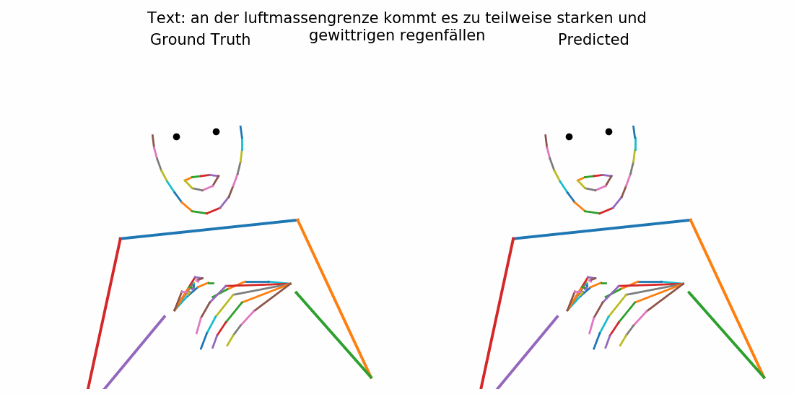

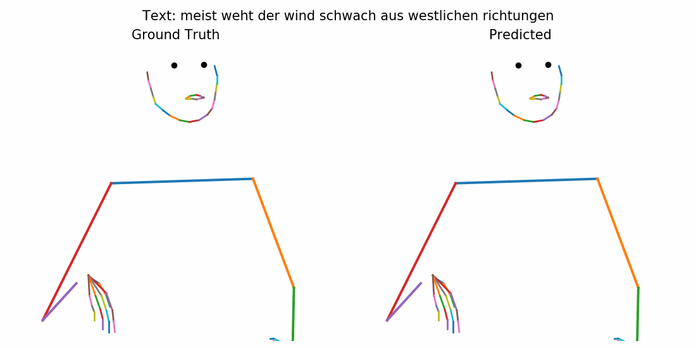

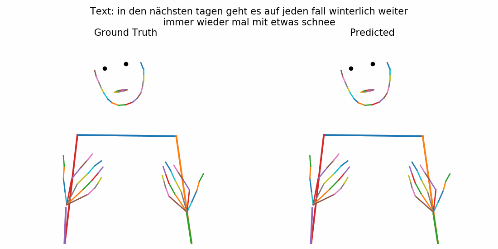

### Meine DGS Annotated

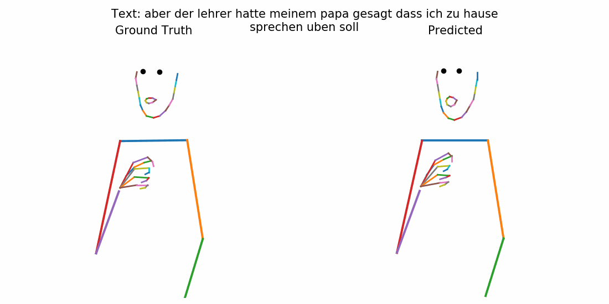

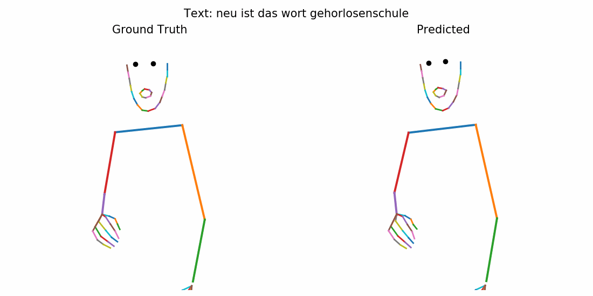

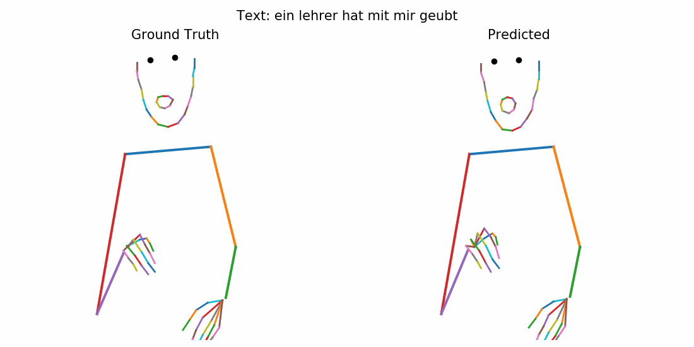

### Comparison with Different k Times
Here we also provide qualitative comparisons under different recursive refinement steps ($k$ times)

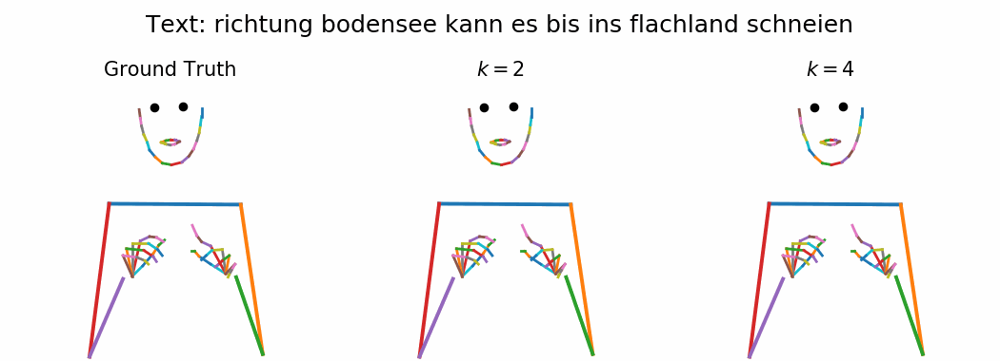

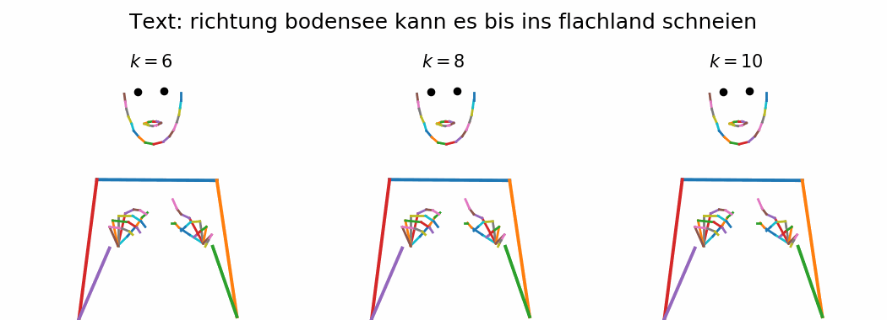

### Comparison to Progressive Transformer
We compare our full approach with the Progressive Transformer baseline optimized with Mean Squared Error (MSE) loss. Our method integrates RTM loss and recursive keypoint to mitigate over-smoothed motions and improve temporal consistency.

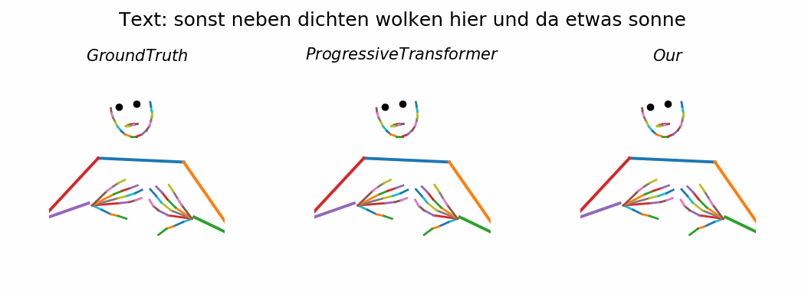

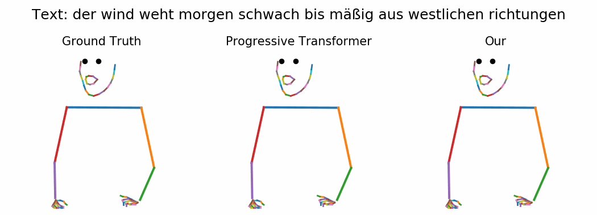

